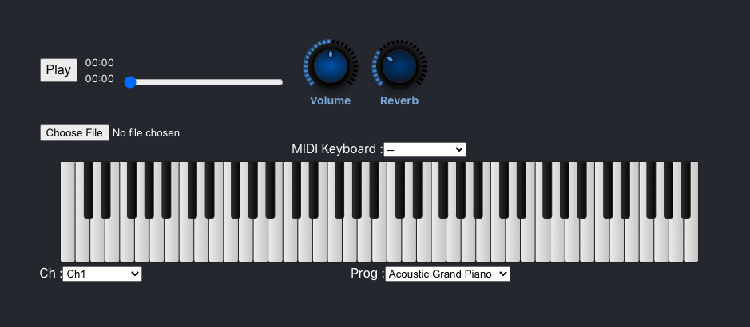

# react-tinysynth

This project is a rewrite of g200kg's tinysynth with react and typescript, the tinySynth ts file is ready for using like a npm module.

I am currently developing a music arrangement software that runs on the browser, and found that the g200kg's tinysynth give me a lot of inspiration, so I re-implement the original code. If you want to learn about my work, please take a look at the VoxelBuilder and MusicEditor at https://box3.codemao.cn/ 

This project was bootstrapped with [Create React App](https://github.com/facebook/create-react-app).

## Available Scripts

In the project directory, you can run:

### `yarn start`

Runs the app in the development mode. 
Open [http://localhost:3000](http://localhost:3000) to view it in the browser.

The page will reload if you make edits. 
You will also see any lint errors in the console.

### `yarn test`

Launches the test runner in the interactive watch mode. 
See the section about [running tests](https://facebook.github.io/create-react-app/docs/running-tests) for more information.

### `yarn build`

Builds the app for production to the `build` folder. 
It correctly bundles React in production mode and optimizes the build for the best performance.

The build is minified and the filenames include the hashes. 
Your app is ready to be deployed!

See the section about [deployment](https://facebook.github.io/create-react-app/docs/deployment) for more information.
